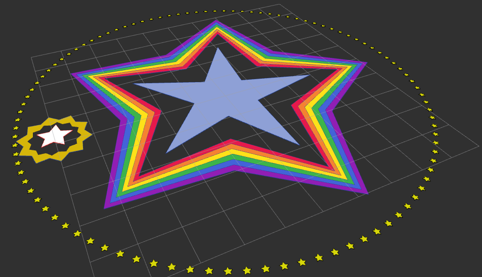

# polygon_ros
Messages and libraries for operating on two dimensional polygons.

In the standard package [`geometry_msgs`](https://github.com/ros2/common_interfaces/blob/rolling/geometry_msgs/msg/Polygon.msg), `Polygon.msg` and `PolygonStamped.msg` are defined, but have three primary limitations.
 * The `Polygon` is defined by `Point32` which uses `float32` limited precision to store the coordinates.
 * The point is also defined in three dimensions, leading to an often ignored Z coordinate.
 * There is no support for [complex polygons](https://en.wikipedia.org/wiki/Complex_polygon) i.e. polygons with holes in them.

This led to the creation of the new messages defined in this package. This work is forked from the ROS 1 version of the [`robot_navigation`](https://github.com/locusrobotics/robot_navigation).

## Data Types

 * The base datatype is `Point2D`, which defines an x and a y coordinate, in 64 bit precision.
 * The `Polygon2D` type defines a [simple polygon](https://en.wikipedia.org/wiki/Simple_polygon) with an ordered list of `Point2D` that are the vertices of the polygon. The first point is connected to the second, the second is connected to the third, and so on, and the last point is also connected to the first.
 * `Polygon2DStamped` is a single simple polygon with a header.
 * `ComplexPolygon2D` defines a complex polygon with one polygon that is the outer perimeter, and an arbitrary number of polygons that define the holes.
 * `Polygon2DCollection` is a list of simple polygons, all with the same frame. There is also an optional per-polygon colors field for display purposes.
 * Similarly, `ComplexPolygon2DCollection` is a list of complex polygons, also with a header, and an optional colors field.

## Polygon Utils
The `polygon_utils` package provides a number of tools for working with `polygon_msgs`.

### Conversions
Note that when converting from `geometry_msgs` to `polygon_msgs`, any information in the z coordinate is discarded.

| to `polygon_msgs` | from `polygon_msgs` |
| -- | -- |
| `Polygon2D polygon3Dto2D(geometry_msgs::Polygon)` |`geometry_msgs::Polygon polygon2Dto3D(Polygon2D)`
| `Polygon2DStamped polygon3Dto2D(geometry_msgs::PolygonStamped)` | `geometry_msgs::PolygonStamped polygon2Dto3D(Polygon2DStamped)`

### Operations
 * `equals` - check if two polygons are equal
 * `movePolygonToPose` - translate and rotate a polygon
 * `isInside` - check if a point is inside a polygon
  * `triangulate` - Decompose a polygon into a set of non-overlapping triangles using an open source implementation of the [earcut algorithm](https://github.com/mapbox/earcut.hpp)

### Python
There are also a few Python-based utility operations available.
 * `polygon_utils.shapely_lib.py` provides conversions from ROS messages to [Shapely](https://shapely.readthedocs.io/en/stable/manual.html) objects, enabling a large library of algorithms to be run. **Note: Requires `shapely` to be installed via `pip`.**
 * `polygon_utils.shortest_path.py` provides methods for determining the shortest path around a collection of polygons. (also uses `shapely_lib`)

## RViz Plugins

The existing [`rviz_default_plugins::PolygonDisplay`](https://github.com/ros2/rviz/blob/ros2/rviz_default_plugins/src/rviz_default_plugins/displays/polygon/polygon_display.cpp) draws only the outline of a given polygon, and cannot fill the polygon in with color. This package has five new RViz displays for polygon data:
 * `polygon_rviz_plugins::Polygon3DDisplay` will display `geometry_msgs/PolygonStamped` messages just like `rviz_default_plugins::PolygonDisplay` except it can fill in the polygon.
 * `polygon_rviz_plugins::PolygonDisplay` displays `polygon_msgs/Polygon2DStamped` messages
 * `polygon_rviz_plugins::ComplexPolygonDisplay` displays `polygon_msgs/ComplexPolygon2DStamped` messages
 * `polygon_rviz_plugins::PolygonsDisplay` (note the S in PolygonS) will display `polygon_msgs/Polygon2DCollection` messages.
 * `polygon_rviz_plugins::ComplexPolygonsDisplay` (note the S in PolygonS) will display `polygon_msgs/ComplexPolygon2DCollection` messages.

Each has three display modes, for displaying just the outline, just the filler, or both.

When displaying polygon collections, you have the option to display a single color, colors from the message, or a set of "unique" colors (limited to 54 colors).

The behavior is showcased by running `ros2 launch polygon_demos polygons.launch.py`. The results are also shown in the screenshot above.
 * The blue star in the middle is a `Polygon2DStamped`
 * The white star is a `geometry_msgs/PolygonStamped`
 * The star burst around the white star is a `ComplexPolygon2DStamped`
 * The ring of yellow stars is a `Polygon2DCollection`
 * The rainbow-colored stars around the blue star are a `ComplexPolygon2DCollection`
